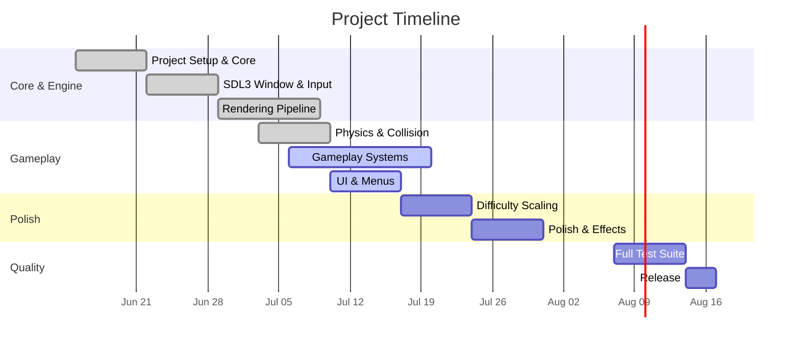

# Development Roadmap

%% 15 phases từ project setup → release. Track progress here. %%

## Overview

| Phase | Tên | Trạng thái | Thời gian |
|-------|-----|-----------|-----------|
| 1 | [[#phase-1-project-setup\|Project Setup & Core]] | ✅ Done | 1 tuần |
| 2 | [[#phase-2-sdl3-window\|SDL3 Window & Input]] | ✅ Done | 1 tuần |
| 3 | [[#phase-3-rendering\|Rendering Pipeline]] | ✅ Done | 1.5 tuần |
| 4 | [[#phase-4-input\|Input System]] | ✅ Done | 0.5 tuần |
| 5 | [[#phase-5-audio\|Audio System]] | ❌ Pending | 1 tuần |
| 6 | [[#phase-6-physics\|Physics & Collision]] | ✅ Done | 1 tuần |
| 7 | [[#phase-7-gameplay\|Gameplay Systems]] | 🟡 In Progress | 2 tuần |
| 8 | [[#phase-8-ui\|UI & Menus]] | 🟡 In Progress | 1 tuần |
| 9 | [[#phase-9-difficulty\|Difficulty Scaling]] | ❌ Pending | 1 tuần |
| 10 | [[#phase-10-polish\|Polish & Effects]] | ❌ Pending | 1 tuần |
| 11 | [[#phase-11-resources\|Resource Management]] | ❌ Pending | 1 tuần |
| 12 | [[#phase-12-save\|Save System & Persistence]] | ❌ Pending | 1 tuần |
| 13 | [[#phase-13-optimization\|Optimization & Profiling]] | ❌ Pending | 1 tuần |
| 14 | [[#phase-14-testing\|Full Test Suite]] | ❌ Pending | 1 tuần |
| 15 | [[#phase-15-release\|Release & Packaging]] | ❌ Pending | 0.5 tuần |

---

## Phase Details

### Phase 1: Project Setup & Core ✅

- [x] CMake build system (3.28+, presets)
- [x] FetchContent dependencies (EnTT, GLM, spdlog)
- [x] Core library (ECS wrapper, EventBus, Math types)
- [x] Coding standard tooling (clang-format)
- [x] CI pipeline (static analysis, build, test)

### Phase 2: SDL3 Window ✅

- [x] SDLWindow implementation
- [x] Application lifecycle (init/run/shutdown)
- [x] VSync, window resize handling

### Phase 3: Rendering Pipeline ✅

- [x] IRenderer interface + SDLRenderer
- [x] Gradient sky background
- [x] Parallax mountains
- [x] Procedural sprites (player, obstacles, ground, coins)
- [x] Text rendering (bitmap font)

### Phase 4: Input System ✅

- [x] IInputDevice interface
- [x] SDLInputDevice (keyboard)
- [x] InputMapper (Command pattern)
- [x] Key rebinding support

### Phase 5: Audio System ❌

- [ ] IAudioDevice interface (done)
- [ ] SDLAudioDevice implementation
- [ ] SFX: jump, death, coin, menu_select
- [ ] Volume control

### Phase 6: Physics & Collision ✅

- [x] PhysicsSystem (gravity, velocity, friction)
- [x] CollisionSystem (AABB broad → narrow)
- [x] Player: jump, coyote time, jump buffer
- [x] Ground collision detection

### Phase 7: Gameplay Systems 🟡

- [x] Player spawning + mechanics
- [x] Obstacle spawning
- [ ] Score system (distance-based + coins)
- [ ] Coin collectibles
- [ ] Game Over condition
- [ ] High score persistence (basic)

### Phase 8: UI & Menus 🟡

- [x] Menu State (title, "press to start")
- [x] Pause overlay
- [x] Game Over screen (score, high score)
- [ ] Settings menu (volume, key bindings)

### Phase 9: Difficulty Scaling ❌

- [ ] Linear difficulty curve
- [ ] Obstacle speed ramping
- [ ] Spawn interval reduction
- [ ] Multiple obstacle types (small, tall, moving)

### Phase 10: Polish & Effects ❌

- [ ] Particle effects (coin collect, death)
- [ ] Screen shake on death
- [ ] Smooth camera transitions
- [ ] Animation frames for player

### Phase 11: Resource Management ❌

- [ ] IAssetLoader interface
- [ ] Asset caching
- [ ] Threaded asset loading

### Phase 12: Save System ❌

- [ ] High score persistence (JSON)
- [ ] Settings persistence
- [ ] Replay recording (basic)

### Phase 13: Optimization & Profiling ❌

- [ ] Profile hot path (RenderSystem, PhysicsSystem)
- [ ] Object pool tuning
- [ ] Render batching
- [ ] Memory analysis (Valgrind/ASan)

### Phase 14: Full Test Suite ❌

- [ ] Core: 50+ unit tests
- [ ] Engine: 30+ tests with mocks
- [ ] Game: 20+ integration tests
- [ ] CI integration: tests + coverage

### Phase 15: Release & Packaging ❌

- [ ] CMake CPack configuration
- [ ] Binary packaging (Linux AppImage)
- [ ] Release notes
- [ ] GitHub release

---

## Progress Tracking

> [!info] Current Phase
> ==Phase 7 (Gameplay) + Phase 8 (UI) in progress.== Dự kiến hoàn thành Phase 10 trong tháng 7.

---

## Related Notes
- [[Design Philosophy]] — vision and MVP scope
- [[Testing Strategy]] — test milestones per phase
- [[Architecture Pitfalls]] — risks per phase
- [[Design Patterns]] — patterns applicable each phase

^development-roadmap
