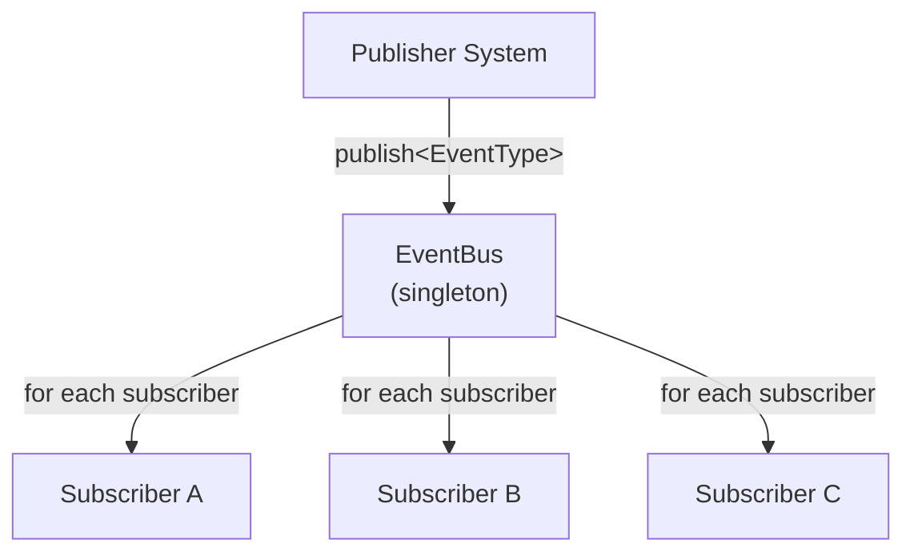

# Event System

%% Event Bus architecture — cách các module giao tiếp mà không biết nhau %%

## Design

**Pattern:** [[Design Patterns#1-observer-event-bus|Observer + Mediator]]
**File:** `core/events/EventBus.hpp`, `core/events/IEvent.hpp`

```cpp
class EventBus {
public:
    template<typename E, typename Handler>
    static void subscribe(Handler&& handler);

    template<typename E, typename... Args>
    static void publish(Args&&... args);
};
```

> [!info] Key Design Decisions
> - **Static methods** — global access, nhưng subscription có thể scoped
> - **Type-safe** — template-based, không need base class
> - **Synchronous** — publish là function call chain, không queue
> - **Zero-allocation** — handlers stored trong fixed-size vector

---

## Architecture



### Subscription Scopes

```cpp
// Global subscription (always active)
EventBus::subscribe<PlayerDeadEvent>(onPlayerDeath);

// Scoped subscription (auto-unsubscribe khi object hủy)
class AudioSystem : public ISubscriber {
    AudioSystem() {
        subscribe<CoinCollectedEvent>(this);
    }
    ~AudioSystem() { unsubscribeAll(this); }
};
```

---

## Event Catalog

### Gameplay Events

| Event | Publisher | Subscribers | Dữ liệu |
|-------|-----------|-------------|---------|
| `PlayerJumpedEvent` | PlayerSystem | AudioSystem | jump strength |
| `PlayerLandedEvent` | CollisionSystem | AudioSystem | landing velocity |
| `PlayerDeadEvent` | CollisionSystem | GameStateMachine, ScoreSystem, AudioSystem | death position |
| `CoinCollectedEvent` | CollisionSystem | ScoreSystem, AudioSystem | coin position |
| `ScoreChangedEvent` | ScoreSystem | UI Renderer | new score, delta |

### Input Events

| Event | Publisher | Subscribers | Dữ liệu |
|-------|-----------|-------------|---------|
| `KeyPressedEvent` | InputMapper | Active Scene | key, modifiers |
| `KeyReleasedEvent` | InputMapper | Active Scene | key |
| `CommandEvent` | InputMapper | Active Scene | command type |

### State Events

| Event | Publisher | Subscribers | Dữ liệu |
|-------|-----------|-------------|---------|
| `GameStartedEvent` | GameStateMachine | ScoreSystem, ObstacleSpawner | - |
| `GamePausedEvent` | GameStateMachine | All systems | - |
| `GameResumedEvent` | GameStateMachine | All systems | - |
| `GameOverEvent` | GameStateMachine | ScoreSystem, SaveSystem | final score |
| `StateChangedEvent` | GameStateMachine | Renderer | previous, current state |

### Utility Events

| Event | Publisher | Subscribers | Dữ liệu |
|-------|-----------|-------------|---------|
| `WindowResizedEvent` | SDLWindow | RenderSystem | new width, height |
| `FocusLostEvent` | SDLWindow | GameStateMachine | - |

---

## Flow Examples

### Player Dies ^player-death-flow

```
CollisionSystem (detect overlap)
  → publish<PlayerDeadEvent>(player, obstacle)
      → AudioSystem: play death SFX
      → ScoreSystem: save score to high score
      → GameStateMachine: transition to GameOver
```

### Coin Collected

```
CollisionSystem (detect overlap)
  → publish<CoinCollectedEvent>(player, coin)
      → ScoreSystem: score += 100, coins++
      → AudioSystem: play coin SFX
      → ParticleSystem: spawn coin particles
      → ObstacleSpawner: mark coin for removal
```

---

## Performance

```cpp
struct EventBusStats {
    size_t activeSubscriptions{0};
    float avgDispatchTime{0};  // Microseconds
    size_t eventsDispatched{0};
};
```

> [!tip] Profiling
> ==Event dispatch cost ~0.5–2μs per event.== Nếu >10μs, cần optimize:
> - Batch events (e.g., `BulkScoreUpdateEvent` thay vì 100 `ScoreChangedEvent`)
> - Ưu tiên direct function call cho hot path (collision → game over)

---

## Testing Events

```cpp
TEST_CASE("PlayerDead triggers GameOver", "[events][gameplay]") {
    bool gameOverTriggered = false;

    EventBus::subscribe<GameOverEvent>([&](const auto&) {
        gameOverTriggered = true;
    });

    EventBus::publish<PlayerDeadEvent>(PlayerDeadEvent{});

    CHECK(gameOverTriggered);
}
```

---

## Future: Replay System ^replay

Event Bus là nền tảng cho replay system:

```cpp
class ReplayRecorder {
    vector<SerializedEvent> m_log;
    template<typename E>
    void record(const E& event) {
        m_log.push_back(serialize(event));
        // forward to actual handlers
    }
};
class ReplayPlayer {
    void play(const vector<SerializedEvent>& log) {
        for (auto& e : log)
            EventBus::publish(e);     // Same events, deterministic
    }
};
```

---

## Related Notes
- [[Design Patterns]] — Observer pattern details
- [[Gameplay Systems]] — which systems publish what
- [[Runtime Flow]] — event dispatch timing
- [[Testing Strategy]] — testing with events
- [[Memory & Performance]] — zero-alloc event dispatch

^event-system
