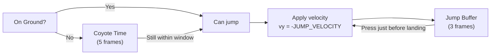
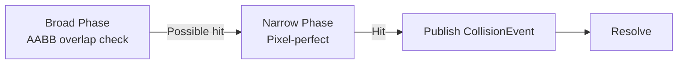

# Gameplay Systems

%% Chi tiết từng hệ thống trong Game Layer — input, player, obstacle, collision, score %%

## ECS Registry Setup ^ecs-registry

```cpp
// Core ECS components
struct Transform {
    Vec2 pos;
    Vec2 prevPos;    // For interpolation
    Vec2 scale{1, 1};
    float rotation{0};
};
struct Velocity {
    Vec2 v;
};
struct Sprite {
    Color tint{White};
    int frameIndex{0};
};

// Tag components (marker — no data)
struct PlayerTag {};
struct ObstacleTag {};
struct CoinTag {};
struct GroundTag {};
```

---

## Player System ^player-system

**File:** `game/player/Player.hpp`

### Components
- `Transform` — vị trí, scale
- `Velocity` — vx, vy
- `Sprite` — visual
- `PlayerTag` — ECS marker

### Jump Mechanics



| Feature | Giá trị | Mục đích |
|---------|---------|----------|
| Coyote Time | 5 frames (~83ms) | Cho phép jump sau khi rời ledge |
| Jump Buffer | 3 frames (50ms) | Cho phép press jump trước khi chạm đất |
| Variable Jump Height | Hold = higher, tap = shorter | Player control feel |
| Gravity Scale | 1.2× (fall) > 0.8× (rise) | "Heavy" feel khi rơi, "light" khi lên |

### States
- **Idle** — đứng yên
- **Running** — animation chạy, ground friction
- **Jumping** → **Rising** (vy < 0) → **Falling** (vy > 0)
- **Dead** — hit obstacle → game over animation

---

## Obstacle System ^obstacle-system

**File:** `game/obstacles/Obstacle.hpp`

### Spawning

```cpp
struct ObstacleSpawnConfig {
    float minInterval = 1.2f;      // Spawn mỗi 1.2s (ban đầu)
    float maxInterval = 0.4f;      // Spawn mỗi 0.4s (tối đa)
    float minSpeed = 300.0f;       // Pixels/s
    float maxSpeed = 800.0f;
    float speedIncreaseRate = 0.1f; // Tăng speed mỗi giây
};
```

### Difficulty Scaling

Công thức scaling theo thời gian:

```cpp
float getCurrentInterval(float elapsed) {
    float t = std::min(elapsed / 120.0f, 1.0f); // Scale over 2 min
    return lerp(minInterval, maxInterval, t);
}
```

Obstacle từ object pool — [[Memory & Performance#object-pool]]:

```cpp
class ObstacleSpawner {
    ObjectPool<Obstacle> m_pool;           // Pooled entities
    DifficultyStrategy& m_difficulty;       // Strategy pattern
};
```

---

## Collision System

**File:** `engine/physics/CollisionSystem.hpp`



| Collision | Hành động |
|-----------|-----------|
| Player ↔ Obstacle | Player dead → Game Over |
| Player ↔ Coin | Coin collect → Score +100 |
| Player ↔ Ground | Grounded → can jump |
| Player ↔ Screen edge | Clamp, game over if off-screen |

---

## Rendering Pipeline

**File:** `engine/renderer/RenderSystem.hpp`

### Pipeline Order (bottom → top)

| Layer | Content | Frequency |
|-------|---------|-----------|
| 1. Sky Background | Gradient sky (lerp màu theo thời gian) | Static |
| 2. Parallax Mountains | Mountains layer, di chuyển 0.3x tốc độ game | Scrolls |
| 3. Ground | Grass ground tiles | Scrolls |
| 4. Obstacles | Sprites từ object pool | Each frame |
| 5. Player | Player sprite, animation | Each frame |
| 6. Coins | Gold coin, collectible | Each frame |
| 7. UI Layer | Score text, vignette, menus | Each frame |

### Procedural Sprites

Không asset files — vẽ bằng SDL3 GPU:

| Object | Draw method | Colors |
|--------|-------------|--------|
| Player | Rectangle + triangle hat | Blue body, red hat |
| Obstacles | Rounded rectangles (biến thể) | Dark red spiked |
| Ground | Rectangle with grass tufts | Brown + green |
| Coins | Circle + gold fill | Yellow/gold |

---

## Score System ^scoring

**File:** `game/scoring/ScoreSystem.hpp`

```cpp
struct ScoreState {
    uint64_t score{0};
    uint64_t highScore{0};
    uint32_t coins{0};

    void update(float playerDist, float speedMult, float difficulty) {
        score += static_cast<uint64_t>(
            playerDist * speedMult * (1.0f + difficulty / 10.0f)
        );
    }
    void addCoin() {
        score += 100;
        coins++;
    }
};
```

---

## Audio System ^audio

> [!warning] Audio là Phase 2
> `IAudioDevice` interface đã define nhưng chưa có implementation. Dùng `NullAudioDevice` cho đến khi implement.

---

## Camera

**File:** `engine/camera/Camera.hpp`

- Theo dõi player theo trục X (horizontal runner)
- Smooth follow với dead zone
- Shake effect khi chết (transform offset)

```cpp
struct Camera {
    Vec2 position;
    Vec2 deadZone{50, 0};  // Không move nếu player trong zone
    float smoothFactor{0.1f};
};
```

---

## Related Notes
- [[Runtime Flow]] — how systems are invoked each frame
- [[Design Patterns]] — patterns used in systems
- [[Event System]] — events systems publish/subscribe
- [[Memory & Performance]] — object pooling for obstacles

^gameplay-systems
