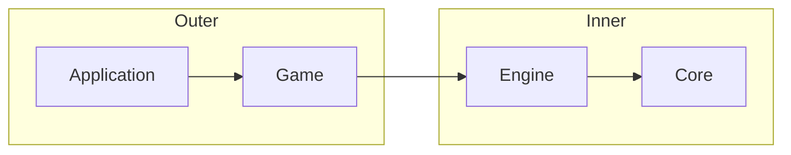
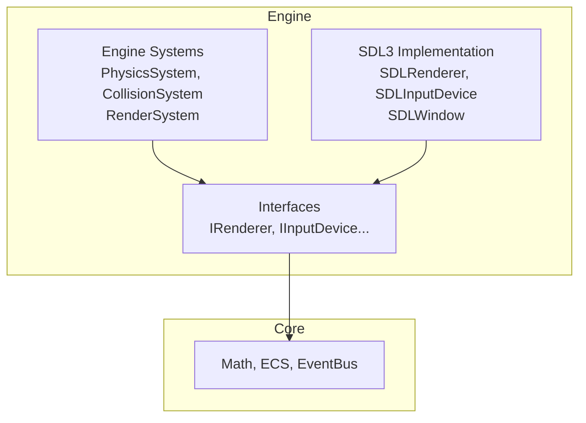

# Layer Architecture — 4-Layer Clean Architecture

%% Chi tiết từng layer, dependency rule, và tại sao 4 layer %%

## Dependency Rule

> **Code trong outer layer có thể phụ thuộc inner layer. Code trong inner layer KHÔNG BAO GIỜ phụ thuộc outer layer.**



---

## Layer 0: Core Layer

**Vị trí:** `/src/core/`
**Loại:** Static library (`.a`)
**Dependency:** Chỉ third-party: EnTT, GLM, spdlog

Chứa:
- [[Gameplay Systems#ecs-registry|ECS Wrapper]] — EnTT registry abstraction
- [[Event System]] — EventBus publish/subscribe
- [[Design Philosophy#ecs-over-oop|Math Types]] — Vec2, Rect, Transform, Color (GLM wrappers)
- Config types, logging wrapper

> [!warning] Core không biết Engine tồn tại
> Core là pure C++20 + thư viện bên thứ ba. Không include Engine header nào. ==Vi phạm quy tắc này sẽ bị reject ngay code review.==

---

## Layer 1: Engine Layer

**Vị trí:** `/src/engine/`
**Loại:** Header-only (interface-oriented)
**Dependency:** Core

Chứa:
- [[Runtime Flow#application|IApplication]] — application lifecycle
- [[Gameplay Systems#rendering|IRenderer]] — GPU renderer interface
- [[Gameplay Systems#input|IInputDevice]] — input abstraction
- [[Design Patterns#observer-event-bus|IAudioDevice]] — audio abstraction
- Physics, Scene, Camera, AssetLoader interfaces

### Engine Phân Cấp Nội Bộ



**Important:** Engine systems (physics, collision, rendering) implement *logic* trên Core, nhưng không biết Game. ==Đây là test-friendly layer — không SDL3 headers trong unit test.==

---

## Layer 2: Game Layer

**Vị trí:** `/src/game/`
**Loại:** Header-only + `.cpp` cho implementation
**Dependency:** Engine, Core

Chứa:
- [[Gameplay Systems#player-system|Player System]]
- [[Gameplay Systems#obstacle-system|Obstacle System]]
- [[Gameplay Systems#scoring|Score System]]
- [[Runtime Flow#state-machine|State Machine]]
- [[Design Patterns#command-pattern|Input Mapper]]
- Engine implementation (MenuState, GameplayState, GameOverState)

> [!example] Game Layer Dependency
> ```cpp
> // GameState.hpp — OK, depends on Engine
> #include <engine/scene/IScene.hpp>
> #include <engine/application/Application.hpp>
> 
> // Engine layer — NOT OK to include game headers
> // #include <game/player/Player.hpp>  ← COMPILE ERROR
> ```

---

## Layer 3: Application Layer

**Vị trí:** `/src/Application/main.cpp`
**Loại:** Entry point executable
**Dependency:** Game, Engine, Core

```cpp
// main.cpp — orchestrator
int main() {
    // 1. Create backend implementations
    SDLWindow window(1280, 720);
    SDLRenderer renderer(window);
    SDLInputDevice input;
    NullAudioDevice audio;  // CI-safe

    // 2. Create game với DI
    Game game(renderer, input, audio, registry);

    // 3. Run
    Application app(game);
    return app.run();
}
```

---

## Data Flow Between Layers

```
User Input → IInputDevice → Game Layer (InputMapper → Commands)
                                    ↓
                            EventBus.publish()
                                    ↓
                    Engine Systems observe events
                    ↓              ↓              ↓
            PhysicsSystem    RenderSystem    AudioSystem
                    ↓
                    EventBus.publish() (e.g., PlayerDeadEvent)
                    ↓
              Game Layer reacts (GameOverState)
```

[[Runtime Flow]] có chi tiết từng bước.

---

## When to Add a New Layer

Quy tắc: ==Nếu module có thể tồn tại độc lập và test được riêng, nó xứng đáng là layer mới.== Nếu không, đặt vào layer gần nhất.

Ví dụ:
- **Multiplayer networking protocol** → layer mới (`net/`)
- **Tools/editor** → layer mới (`tools/`)
- **Thêm animation system** → đặt trong Engine (`engine/animation/`)
- **Thêm weapon system** → đặt trong Game (`game/weapons/`)

---

## Related Notes
- [[Design Philosophy]] — why 4 layers
- [[Module Dependency Graph]] — exact dependency paths
- [[Directory Structure]] — where each layer lives
- [[Architecture Pitfalls#layer-violation]] — common mistakes

^layer-architecture
