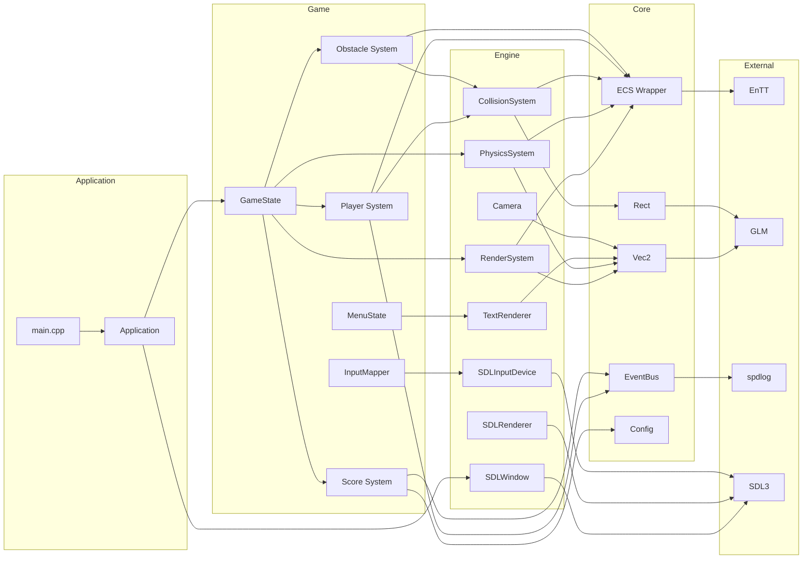

# Module Dependency Graph

%% Chi tiết dependency giữa các module — biết module A có phụ thuộc module B không %%

## Full Dependency Graph



> [!info] Quy tắc
> Mũi tên = "phụ thuộc vào". Dependency direction: Application → Game → Engine → Core → External.

---

## Include Map

Layer nào include được layer nào:

```
        Can include → | External | Core | Engine | Game | Application
Include ↓             |          |      |        |      |
──────────────────────┼──────────┼──────┼────────┼──────┼────────────
External              │    ✓     |  ❌  |   ❌   |  ❌  |     ❌
Core                  │    ✓     |  ✓   |   ❌   |  ❌  |     ❌
Engine                │    ✓     |  ✓   |   ✓    |  ❌  |     ❌
Game                  │    ✓     |  ✓   |   ✓    |  ✓   |     ❌
Application           │    ✓     |  ✓   |   ✓    |  ✓   |     ✓
```

---

## Critical Dependency Paths

### Player Jump (Game → Engine → Core)

```
JumpCommand (Game)
  → Velocity updated (Game)
    → PhysicsSystem (Engine)
      → Transform updated (Engine)
        → Vec2 operations (Core)
          → GLM
```

### Collision (Engine → Core)

```
CollisionSystem (Engine)
  → Rect::intersects (Core)
    → Vec2 comparisons (Core)
      → GLM
```

### Render Frame (Full Stack)

```
main.cpp → Application::run
  → GameState::update → RenderSystem::render
    → IRenderer::beginFrame (→ SDLRenderer)
    → ECS view iteration (→ EnTT)
    → Vec2→SDL_FPoint conversion (→ GLM/SDL3)
    → IRenderer::endFrame (→ SDLRenderer)
```

---

## Circular Dependency Detection

Liệt kê include trong project:

```bash
grep -rn '#include "\.\.' src/ --include="*.hpp" | \
    grep -v 'test_' | \
    awk '{print $2}' | sort | uniq
```

Nếu thấy pattern này, đó là circular dependency:

```
engine/PhysicsSystem.hpp → game/Player.hpp
game/Player.hpp → engine/PhysicsSystem.hpp  ← CIRCULAR!
```

> [!warning] Circular Dependencies
> Mỗi khi phát hiện circular dependency, ==dừng lại và refactor.==
> Giải pháp: [[Event System]] hoặc [[Design Patterns#3-command-pattern|Command Pattern]].

---

## What If I Need to Cross Layers?

Luồng chính xác:

```
You want:  Obstacle dies → Audio plays
Don't:     ObstacleSystem calls AudioSystem directly
Instead:   1. ObstacleSystem publishes ObstacleDestroyedEvent
           2. AudioSystem subscribes and plays sound
```

[[Event System]] có danh sách events và flow.

---

## Related Notes
- [[Layer Architecture]] — layer rules
- [[Event System]] — cross-module communication
- [[Third Party Libraries]] — external dependency details
- [[Architecture Pitfalls#layer-violation]] — what not to do

^module-dependency-graph
