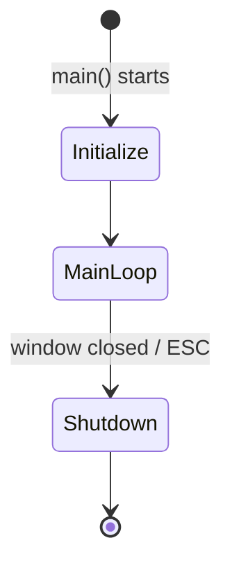
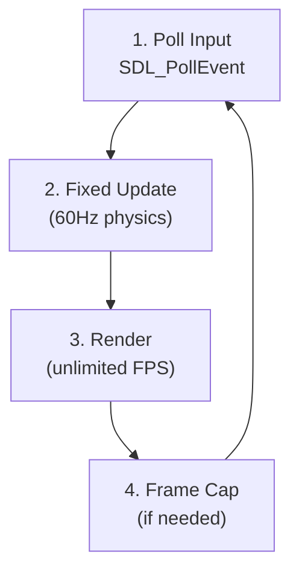
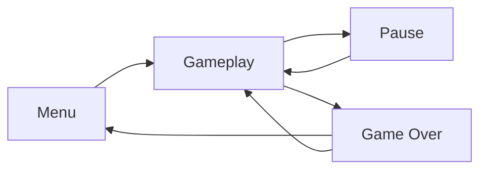

# Runtime Flow

%% How the game actually runs — từ startup → main loop → shutdown %%

## Application Lifecycle



### Initialize (1 frame)
1. Parse config (window size, VSync, audio volume)
2. Create SDLWindow → SDLRenderer → SDLInputDevice
3. Create [[Directory Structure#game|Game]] với dependency injection
4. Create [[Gameplay Systems#ecs-registry|ECS Registry]], seed với initial entities
5. GameStateMachine starts → push [[Design Patterns#state-pattern|MenuState]]
6. ==Tất cả asset loading, validation, assertions chạy ở đây. Nếu lỗi → fail fast, crash với message rõ ràng.==

### Main Loop (mỗi frame)



### Shutdown (1 frame)
1. Stop game loop
2. Cleanup ECS registry (entities auto-destroy components)
3. Destroy SDL resources (window, renderer)
4. ==Không leak. Valgrind/ASan clean.==

---

## Fixed Timestep Main Loop ^main-loop

```cpp
constexpr float TICK_RATE = 1.0f / 60.0f;
float accumulator = 0.0f;

while (!shouldQuit) {
    float dt = clock.restart();         // Wall-clock delta
    accumulator += dt;

    while (accumulator >= TICK_RATE) {  // Catch up physics
        processInput();                  // 1. Poll input
        fixedUpdate(TICK_RATE);          // 2. Fixed timestep update
        accumulator -= TICK_RATE;
    }

    render(accumulator / TICK_RATE);     // 3. Render với interpolation
    frameCap();                           // 4. Frame cap (optional)
}
```

> [!info] Why Fixed Timestep?
> - Player jump cao như nhau trên máy 30fps và 144fps
> - Collision detection deterministic
> - Object spawning predictable
> - ==Input lag không ảnh hưởng game speed==

### Interpolation

Render nhận `alpha [0, 1]` — tỉ lệ giữa 2 physics ticks:

```cpp
void render(float alpha) {
    for (auto [entity, transform, sprite] : registry.view<Transform, Sprite>()) {
        Vec2 renderPos = transform.prevPos * (1 - alpha) + transform.pos * alpha;
        drawSprite(sprite, renderPos);
    }
}
```

---

## State Machine ^state-machine



Mỗi state implement `IScene`:

| State | Enter | Update | Exit |
|-------|-------|--------|------|
| Menu | Hiển thị title, "Press SPACE" | Chờ input → Gameplay | Cleanup menu UI |
| Gameplay | Reset world, spawn player | Tick physics, spawn obstacles | Save score |
| Pause | Freeze world, show overlay | Chờ input → Resume/Quit | Unfreeze world |
| Game Over | Show score, high score | Chờ input → Restart/Menu | Save high score |

---

## Input Flow ^input-flow

```
SDL_PollEvent → SDLInputDevice → InputMapper → Command → EventBus
```

| Layer | Xử lý |
|-------|-------|
| SDL | Raw keycodes (SDL_Scancode) |
| Engine IInputDevice | Normalized key events |
| Game InputMapper | Key → Command mapping (configurable) |
| Game Command | Execute logic |
| EventBus | Notify systems (e.g., JumpCommand → PlayerJumpedEvent) |

> [!tip] Rebindable keys
> InputMapper dùng [[Design Patterns#command-pattern|Command Pattern]], cho phép rebind keys mà không sửa system code. Xem `InputMapper.hpp`.

---

## Event Flow

```
                  ┌──────────────┐
                  │  EventBus    │
                  │  (singleton) │
                  └──────┬───────┘
                         │
     ┌───────────┬───────┼───────────┬──────────┐
     ▼           ▼       ▼           ▼          ▼
┌─────────┐ ┌─────────┐ ┌────────┐ ┌────────┐ ┌──────────┐
│Physics  │ │Collision│ │Render  │ │Score   │ │Audio     │
│System   │ │System   │ │System  │ │System  │ │System    │
└─────────┘ └─────────┘ └────────┘ └────────┘ └──────────┘
```

Chi tiết event types: [[Event System]].

---

## Related Notes
- [[Event System]] — event catalog and bus design
- [[Gameplay Systems]] — what happens in each update tick
- [[Layer Architecture]] — how layers participate in flow
- [[Memory & Performance#hot-path]] — optimization in the loop

^runtime-flow
