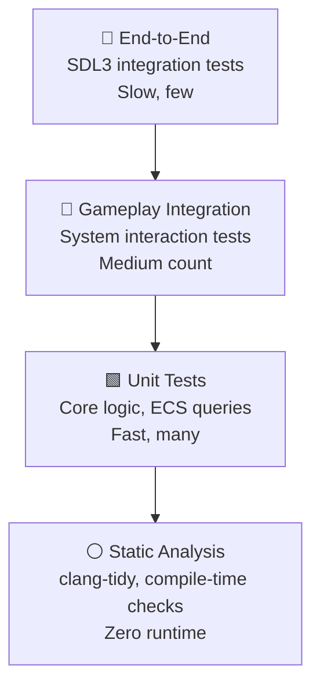

 
# Testing Strategy

%% Test pyramid, tools, và patterns cho từng layer %%

## Test Pyramid



| Layer | Framework | Time | Count Target | Dependency |
|-------|-----------|------|-------------|------------|
| Static Analysis | clang-tidy | Compile time | 0 runtime | clang |
| Core Unit | Catch2 | < 1ms each | 50+ tests | None (pure logic) |
| Engine Unit | Catch2 + mocks | < 5ms each | 30+ tests | Mock backends |
| Game Integration | Catch2 + fakes | < 50ms each | 20+ tests | Fake SDL |
| E2E | SDL3 + Wait | Minutes | 3–5 tests | Real SDL3 |

---

## What to Test (by Layer)

### Core Layer — Pure Logic

```cpp
TEST_CASE("Vec2 addition", "[core][math]") {
    Vec2 a{1, 2};
    Vec2 b{3, 4};
    CHECK((a + b) == Vec2{4, 6});
}

TEST_CASE("EventBus pub/sub", "[core][events]") {
    int received = 0;
    EventBus::subscribe<TestEvent>([&](auto&) { received++; });
    EventBus::publish(TestEvent{});
    CHECK(received == 1);
    EventBus::reset();  // Clean global state giữa các tests
}
```

**Test:** Math types, ECS queries, Event dispatch, Config parsing.

**Không test:** EnTT internals (đã test bởi thư viện).

### Engine Layer — With Mocks

```cpp
struct MockRenderer : IRenderer {
    bool beginFrameCalled = false;
    void beginFrame() override { beginFrameCalled = true; }
    // ... other overrides
};

TEST_CASE("RenderSystem calls beginFrame", "[engine][renderer]") {
    MockRenderer renderer;
    Registry reg;
    RenderSystem system(renderer, reg);

    system.update(1.0f / 60.0f);

    CHECK(renderer.beginFrameCalled);
}
```

**Test:** Physics system, Collision detection (AABB), Render pipeline ordering.

**Không test:** SDL3 implementation details.

### Game Layer — Integration

```cpp
TEST_CASE("Player jump mechanics", "[game][player]") {
    Registry reg;
    auto player = createTestPlayer(reg);
    auto& vel = reg.get<Velocity>(player);

    // Simulate jump command
    InputMapper::execute(JumpCommand{}, reg);

    CHECK(vel.v.y < 0);             // Going up
    CHECK(std::abs(vel.v.y) == JUMP_VELOCITY);  // Exact velocity
}
```

**Test:** State machine transitions, Scoring formulas, Difficulty curves.

**Không test:** Rendering, input mapping (engine layer).

---

## Mock Strategy ^dependency-injection

```cpp
// In test, replace real implementations with mocks
TEST_CASE("Game over screen shows score", "[game][ui]") {
    MockRenderer renderer;
    MockInputDevice input;
    NullAudioDevice audio;
    Registry reg;

    Game game(renderer, input, audio, reg);
    game.start();

    // Simulate game over
    EventBus::publish(GameOverEvent{500});

    // Verify renderer was called with score text
    CHECK(renderer.lastTextDrawn == "Score: 500");
}
```

---

## What NOT to Test

- **SDL3 APIs** — vendor-tested
- **EnTT internals** — vendor-tested
- **GLM math correctness** — vendor-tested
- **Getter/setter boilerplate** — waste of time
- **Temporary debug code** — remove it, don't test it
- **==Code you just wrote and verified manually==** — write test for *regression*, not for *verification of just-written code*

> [!tip] Test philosophy
> Test behavior, not implementation. Nếu refactor internal implementation mà behavior không đổi, test không cần sửa.

---

## Performance Regression Tests

```cpp
TEST_CASE("Player system update < 1ms", "[perf]") {
    Registry reg;
    auto player = createTestPlayer(reg);
    PlayerSystem system(reg);

    auto start = Clock::now();
    for (int i = 0; i < 1000; i++) {
        system.update(1.0f / 60.0f);
    }
    auto elapsed = Clock::now() - start;

    CHECK(elapsed.count() < 1'000'000);  // < 1ms per 1000 updates
}
```

> [!warning] Performance tests không chạy trong CI (quá nhiễu).
> Chạy manually trên máy dev khi cần profile.

---

## Running Tests

```bash
# All tests
cd build && cmake --build . && ctest --output-on-failure

# Specific category
ctest -R "core"        # Core layer tests
ctest -R "game"        # Game layer tests
ctest -R "perf"        # Performance tests

# Verbose single test
./tests/unit/core_tests "[math]"
```

---

## Related Notes
- [[Design Philosophy#everything-is-replaceable]] — DI enables testing
- [[Event System]] — testing event-driven code
- [[Layer Architecture]] — layer separation enables isolated testing
- [[Architecture Pitfalls#no-tests]] — risks of insufficient testing

^testing-strategy
