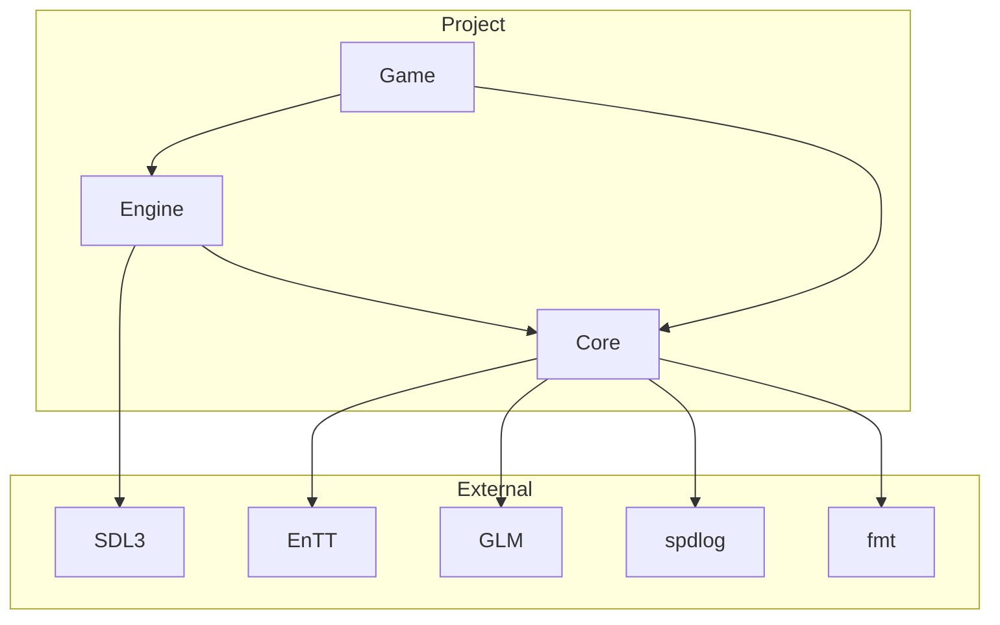

# Third Party Libraries

%% All external dependencies — why they exist and what they do %%

## Dependency Management

All dependencies via **CMake FetchContent** — no system-installed packages, no submodules:

```cmake
# cmake/Dependencies.cmake
FetchContent_Declare(
    EnTT
    GIT_REPOSITORY https://github.com/skypjack/entt.git
    GIT_TAG v3.13
)
```

---

## Library Catalog

### EnTT v3.13 — ECS Framework

| | |
|---|---|
| **Dùng cho** | Game object management, component iteration |
| **File** | `core/ecs/Registry.hpp` (wrapper) |
| **Lý do chọn** | Header-only, C++20 concepts, fastest ECS implementation |
| **Alternatives** | Artemis (Java), Flecs (C), Unity ECS |
| **Tradeoff** | EnTT API functional, khó đọc hơn OOP. Wrapper giải quyết. |

### GLM 1.0 — Math Library

| | |
|---|---|
| **Dùng cho** | Vec2, matrix transforms, lerp, clamping |
| **File** | `core/math/Vec2.hpp`, `Rect.hpp` |
| **Lý do** | GLSL-compatible syntax, header-only, zero overhead |
| **Alternatives** | DirectXMath, Eigen |
| **Tradeoff** | GLM = 100% CPU math. GPU math dùng SDL3. |

### spdlog — Logging

| | |
|---|---|
| **Dùng cho** | Debug logging, error reporting, profiling |
| **File** | Core wrapper (trong `core/core.hpp`) |
| **Lý do** | Fastest C++ logger, header-only mode, sinks pattern |
| **Tradeoff** | Header-only mode tăng compile time. Dùng compiled mode trong release. |

### fmt — String Formatting

| | |
|---|---|
| **Dùng cho** | fmt::format cho log, debug UI |
| **Note** | spdlog phụ thuộc fmt, kéo theo tự động |
| **C++20** | `std::format` dùng fmt implementation |

### SDL3 — Platform Layer

| | |
|---|---|
| **Dùng cho** | Window, input, GPU renderer, audio |
| **File** | `engine/platform/sdl3/` |
| **Lý do** | Cross-platform, GPU acceleration, active development |
| **Version** | SDL3 (not SDL2) — GPU renderer via `SDL_Renderer` |
| **Tradeoff** | SDL3 còn mới, API có thể thay đổi. Cần theo dõi changelog. |

### Catch2 v3 — Testing

| | |
|---|---|
| **Dùng cho** | Unit tests, BDD-style sections |
| **File** | `tests/unit/` |
| **Lý do** | Header-only, CTest integration, BDD sections |
| **Alternatives** | GoogleTest, doctest |
| **Tradeoff** | Catch2 sections compile chậm hơn doctest. Chấp nhận được ở scale này. |

---

## Dependency Graph



> [!info] FetchContent Tree Size (first build)
> | Dependency | Download size | Build time |
> |------------|---------------|------------|
> | EnTT | ~500 KB | ~2s (header-only) |
> | GLM | ~3 MB | ~3s (header-only) |
> | spdlog | ~400 KB | ~5s |
> | fmt | ~300 KB | ~4s |
> | SDL3 | ~5 MB | ~30s (C library) |
> | Catch2 | ~200 KB | ~3s (header-only) |
> | **Total** | **~9.4 MB** | **~47s** |

---

## Adding a New Dependency

Quy trình:

1. Thêm vào `cmake/Dependencies.cmake` qua `FetchContent_Declare`
2. Thêm target link trong `CMakeLists.txt` layer tương ứng
3. Cập nhật [[Directory Structure]] nếu cần thư mục mới
4. ==Chứng minh dependency cần thiết — không "just in case".==

> [!question] Decision Tree
> ```
> Có thể implement với std::? → YES → Không thêm dependency
> Có thể implement trong 2 ngày? → YES → Tự viết, không thêm dep
> Library active maintenance? → NO → Không thêm (risk)
> ⇒ Tất cả YES → Có thể thêm
> ```

---

## Related Notes
- [[Design Philosophy]] — why fewer dependencies is a principle
- [[Layer Architecture]] — which layer uses which library
- [[Architecture Pitfalls#dependency-hell]] — dependency management mistakes

^third-party-libraries
