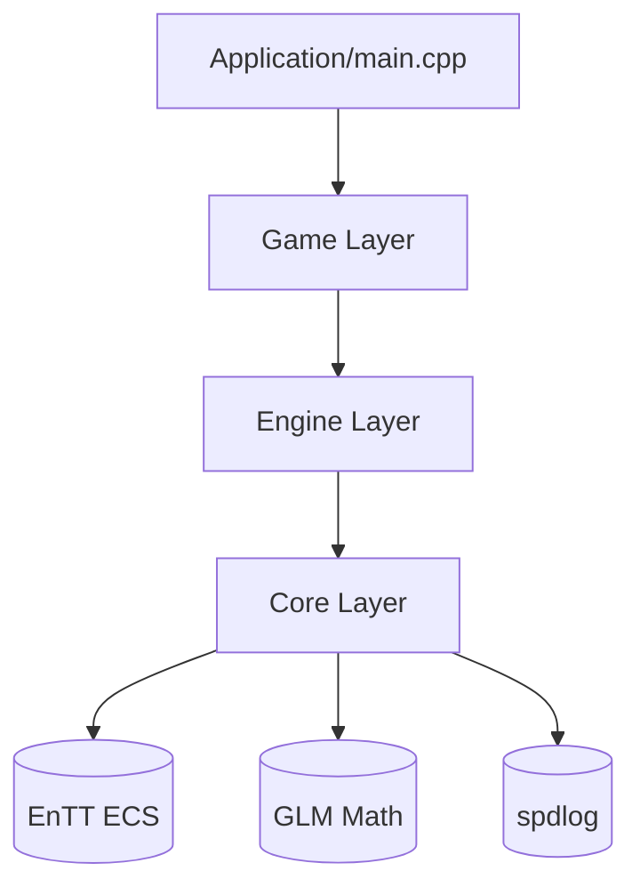

# Game Architecture Overview

Dự án game platformer 2D viết bằng **C++20 + SDL3**, kiến trúc 4-layer Clean Architecture.

%% This file serves as the central hub for all architecture decisions. %%

## Kiến trúc tổng quan



## Layers

### Core Layer — `/src/core/`

Thư viện tĩnh (`.a`), zero external deps ngoài EnTT/GLM.

| Component | Mô tả |
|-----------|-------|
| [[ECS Wrapper]] | Abstraction trên EnTT registry |
| [[EventBus]] | Publish/subscribe event system |
| [[Math Types]] | GLM wrappers: `Vec2`, `Rect`, `Transform` |
| [[Logger]] | spdlog singleton wrapper |

### Engine Layer — `/src/engine/`

Header‑only, interface trừu tượng. Xem [[Engine Interfaces]] để biết contract.

```cpp
class IWindow { /* platform window */ };
class IRenderer { /* SDL3 GPU renderer */ };
class IInputManager { /* keyboard + gamepad */ };
```

### Game Layer — `/src/game/`

Logic game cụ thể:

- [[Player System]] — movement, jump (coyote time, jump buffer)
- [[Obstacle System]] — spawn, despawn, difficulty scaling
- [[Score System]] — điểm số, high score
- [[State Machine]] — menu → gameplay → pause → game over

> [!info] State Machine Flow
> ```
> Menu --> Gameplay --> Pause --> Gameplay
>                     Gameplay --> Game Over --> Menu
> ```

## Physical File Structure

![[Project Tree.canvas|Project Tree Canvas]]

## Rendering Pipeline

1. **Clear** — gradient sky background (lerp màu theo thời gian)
2. **Parallax** — mountains nền di chuyển chậm hơn
3. **Game Objects** — player, obstacles, coins
4. **UI Layer** — score text, menus, Vignette overlay

![[Rendering Pipeline Diagram]]

## ECS Architecture

Core components:

| Component | Data |
|-----------|------|
| `Transform` | position, scale, rotation |
| `Velocity` | vx, vy |
| `Sprite` | spritesheet frame, tint color |
| `PlayerTag` | empty marker — identity component |
| `ObstacleTag` | empty marker |
| `CoinTag` | empty marker |

> [!warning] Hot Path
> [[Player System]] update chạy **mỗi frame** (60fps). Profile kỹ. ==Không allocation trong update loop.==

## Key Design Decisions

Xem chi tiết tại [[ADR Index]].

1. [[001-use-catch2]] — Catch2 v3 cho unit testing
2. [[002-ecs-pattern]] — EnTT ECS, không OOP hierarchy
3. [[003-sdl3-renderer]] — SDL3 GPU renderer (không SDL2 software)

> [!question] Tại sao không dùng OOP?
> ECS cho phép composition linh hoạt hơn inheritance. Một entity vừa là player vừa có thể physics — không cần diamond inheritance.

## Scoring System

Công thức tính điểm:

$$score = dist \times speedMultiplier \times (1 + \frac{difficulty}{10})$$

Coin bonus: $+100$ điểm mỗi coin.

Xem [[Score System#Formula Details]].

## Testing Strategy

| Layer | Test Tool | Scope |
|-------|-----------|-------|
| Core | Catch2 | Unit tests — pure logic, mock-free |
| Engine | Catch2 + mocks | Interface contracts |
| Game | Catch2 + SDL3 fakes | System integration |

> [!tip] Chạy test
> ```bash
> cd build && cmake --build . && ctest --output-on-failure
> ```

## Related Notes

- [[CodingStandard]] — naming conventions, style guide
- [[Skills-Overview]] — Obsidian skills system ^skills-ref
- [[Superpowers Workflow]] — cách dùng agent skills hiệu quả

---

## Tags Index

- #game #architecture — tất cả file về architecture
- #ecs — Entity Component System patterns
- #sdl3 — SDL3 specific knowledge
- #cpp20 — C++20 features used

^architecture-overview
